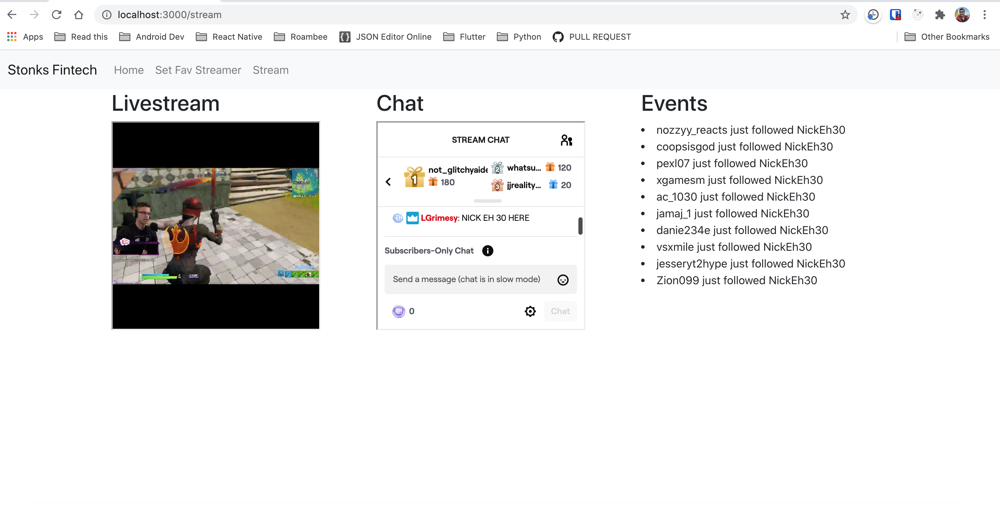
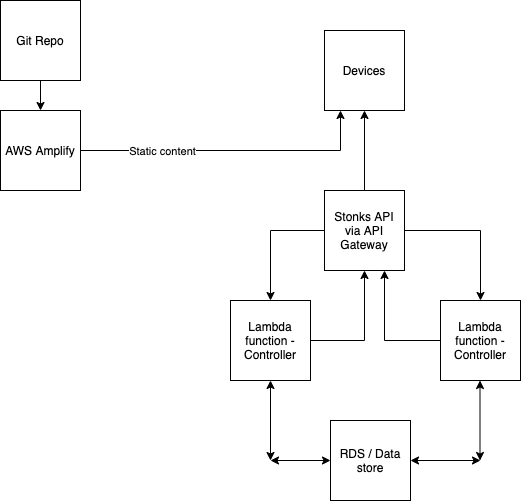

# Twitch Experiments
Here you will find a simple Express web app illustrating how to authenticate Twitch API calls using the OAuth authorization code flow.  This sample uses [Express](http://expressjs.com/), [Passport](http://passportjs.org/) for the server and [ReactJS](https://reactjs.org/) for the client.

DEMO: [Heroku App](https://sleepy-plains-09747.herokuapp.com)



## Installation
1. After you have cloned this repository, use [npm](https://www.npmjs.com/) to install dependencies on the backend.

```sh
$ npm install
```
2. `cd` to the client folder
```sh
$ cd client
```
3. Use `yarn` to install dependencies
```sh
$ yarn add
```

## Usage Server
Before running this sample, you will need to set siz configuration fields in your .env:

1. TWITCH_CLIENT_ID - This is the Client ID of your registered application.  You can register a new application at [https://dev.twitch.tv/dashboard/apps]
2. TWITCH_CLIENT_SECRET - This is the secret generated for you when you register your application, do not share this. In a production environment, it is STRONGLY recommended that you do not store application secrets on your file system or in your source code.
3. SESSION_SECRET -  This is the secret Express session middleware uses to sign the session ID cookie.
4. CALLBACK_URL - This is the callback URL you supply when you register your application.  To run this sample locally use [http://localhost:3000/auth/twitch/callback]
5. TWITCH_WEBHOOK_BASE_URL - Base URL of where you want the Twitch webhooks to be received.
6. PORT - Port where you want to run your server.

Optionally, you may modify the requested scopes when the /auth/twitch route is defined.

After setting these fields, you may run the server.

```sh
$ node index.js
```

## Usage Client
Before running the client, you need to set the two configuration fields in the `.env` file. 

1. REACT_APP_TWITCH_CLIENT_ID - Your Twitch Client ID
2. REACT_APP_SERVER_BASE_URL - Base URL for your server. To test locally you may use [http://localhost:4000]
3. REACT_APP_SERVER_BASE_DOMAIN - Domain name of your server. For local you may user `localhost`


After setting these fields, you may run the server

```sh
$ npm start
```

## Next Steps


## Assumptions

1. One embedded livestream of the selected streamer and the chat for that livestream is shown on the page.
2. Events shows two types of events - Follows and stream events. 
3. Twitch API for searching `channels` does a fuzzy search on the user name. So it might return a stream of some other user with similar name. This is more of a caveat.


## Architecture
1. `reactjs` client makes a OAuth request to the `express` server. 
2. User is redirected to the Twitch login.
3. Once user logs in to Twitch, the session is stored on the server using `Passport`. A JWT token is generated and sent to the client. 
4. Once the user chooses his/her favorite streamer, a request is sent to the server to subscribe to webhooks for follow and stream change events. 
5. A socket connection is established between the client and the server when the user access `/stream` route. 
6. As soon as a webhook is received for a subscribed evernt - a socket event is emitted.
7. How is the appropriate client selected for sending the socket event? - When the socket connection is initially established, the user is authorized using a JWT token. Server decodes this token and extracts the `user_id` from it. The server maintains a map of all the users and their corresponding sockets using this `user_id`. 
8. How are different webhook subscriptions maintained for different users? - Each webhook subscription for a user contains the `user_id` in the URL. The webhook callback looks something like this - `/webhook/callback/:user_id`. Whenever we receive a webhook event, we figure out the appropriate user from the URL. Once we have the `user_id`, we get the socket for this user from our map of active clients and emit on that socket. 


## How will we deploy this to AWS?

AWS provides all the services that we need to run this app. We may use 

1. AWS Lambda to host our controller functions. These will be functions that perform the business logic of our app.
2. AWS APIGateway to host our routes. These routes will call our Lambda functions. 
3. AWS Amplify to host our static client content.

The advantage of using all AWS services is that scaling will be automatically taken care of. AWS will dynamically scale resources as demand rises or falls. 

AWS APIGateway also has EDGE-Aware services which route the client calls to the nearest CDN. 



The bottleneck would be the webhook receiver. We have only one route which receives these webhooks and fires events to the clients. With an increase in clients, we will start seeing delays in the event delivery. 